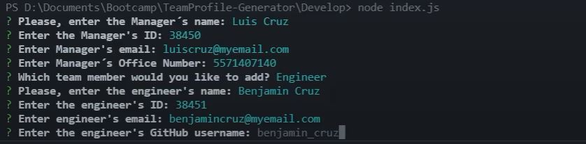
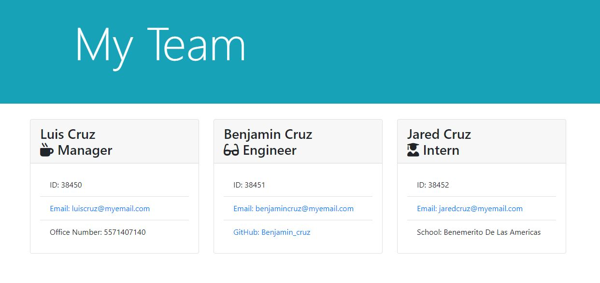

# Team-Profile-Generator

## Description

This project consists of developing a Team Profile Generator using JavaScript and Node.JS tools. This Profile Generator will be used to create HTML files to displays relevant information about the current team members. The levels considered that a Manager, Engineer and Intern can be generated. The information considered for each level is the following:

* Manager level: 
    * Name
    * ID
    * Email
    * Phone Number

* Engineer level:
    * Name
    * ID
    * Email
    * GitHub username

* Intern level:
    * Name
    * ID
    * Email
    * School name

## Technologies

This project was developed using:

* JavaScript
* Node.js
* Inquirer Package
* Path Package
* Replace Package

To install the packages you must write the following npm in the terminal:
```
npm install inquirer
npm install path
npm install replace
```

## Mock Up

### Terminal Mock Up



### HTML Mock Up



To see a demonstrative video on how to use the tool, click on the following link: https://drive.google.com/drive/folders/184goyV14sN6B57ZP_xq2X1LWSs22hCqG?usp=sharing